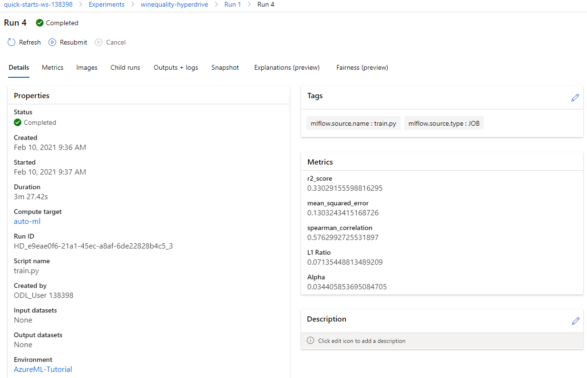

# Wine quality

We use AutoML to explore model types, and Hyperdrive to explore model hyperparameters, to build a model that can predict subjective wine 'quality' from measurable physicochemical properties such as pH and sulfate content.

## Dataset

### Overview
We will be using the Wine Quality dataset made accessible [here](https://archive.ics.uci.edu/ml/datasets/wine+quality).

The dataset contains the physicochemical properties of 1599 red wine samples. The data includes, in column order: `fixed acidity`, `volatile acidity`, `citric acid`, `residual sugar`, `chlorides`, `free sulfur dioxide`, `total sulfur dioxide`, `density`, `pH`, `sulphates`, `alcohol`, and the final column is the target variable, `quality` (score between 0 and 10).

### Task
We will be using all features except `quality`, to try and predict wine quality. All the features are numerical and continuous, which allows us to hypothesize whether a regression model may be able to score quality given the input features.

### Access
The data is made accessble through a public link to the UCI data archive.

## Automated ML
Given that this is a regression task, I chose the normalized root mean squared error (NRMSE) as the primary metric to optimize. This calculates the mean difference between sample targets and predicted values, as a proportion of the target range. We are looking to minimize this value, i.e. look for the model with the smallest overall difference between predicted value and target value.

### Results


The last two models trained are the StackEnsemble and VotingEnsemble. As usual these are the best two models in the group.


The VotingEnsemble was the better of the two, and yielded a NRMSE of 0.1207. The ensemble model consisted of the following models:
* LightGBMRegressor (run 0, weight 7/15) - best model apart from the ensembles, given the highest weighting
* GradientBoostingRegressor (run 34, weight 1/15)
* RandomForestRegressor (run 29, weight 1/15)
* RandomForestRegressor (run 33, weight 1/15)
* GradientBoostingRegressor (run 32, weight 2/15)
* ExtraTreesRegressor (run 26, weight 1/15)
* DecisionTreeRegressor (run 3, weight 1/15)
* DecisionTreeRegressor (run 22, weight 1/15)

## Hyperparameter Tuning

## Hyperdrive Configuration
For the Hyperdrive run, we explored the parameter space of an ElasticNet model. ElasticNet is a linear model that combines L1 and L2 regularization. The parameters `alpha` and `l1_ratio` control the regularization penalties. Both are continuous parameters. 

The `l1_ratio` is a measure of how much the model uses L1 vs L2 regularization. This parameter varies between 0 (100% L1) and 1 (100% L2). Based on some prior cursory review of the variables, not documented here, some of the input features appear to vary relatively linearly with the target variable, therefore we should expect a better model towards the L1 end of the spectrum. We will set this parameter to vary across the full 0-1 range to validate this hypothesis.

`alpha` is a multiplier of the penalty terms which reduce overfitting. Given the data, overregularization may underfit the model too much so we expect this to be low. Given that it is a multiplier we set the range to be `loguniform` across the 1x10^-4 to 1x10^-2 space.

The Bandit early stopping policy with a 20% slack ratio terminates runs if the primary metric does not match the best run so far within 20% (e.g. if the best run so far had a NRMSE of 0.5, any run with a NRMSE above 0.6 will be terminated). This is suitable for a regression task.

### Results


As expected, the lowest `alpha` and `l1_ratio` values produced the model with the lowest error. The model with the lowest NMRSE was trained with `alpha`=0.0344 and `l1_ratio`=0.0714.



### Best model between Hyperdrive and AutoML
The AutoML run produced a model with a lower NMRSE than the Hyperdrive run (0.12073 vs 0.13032). We will take this as the best model.

## Model Deployment
The deployed model endpoint is shown here:


The following code can be used to query the model.
```
import json
import requests
import pandas as pd

scoring_uri = ''  # insert the URL to the deployed endpoint

data_file_source = 'https://archive.ics.uci.edu/ml/machine-learning-databases/wine-quality/winequality-red.csv'
df = pd.read_csv(data_file_source, delimiter=';').dropna()
# select a few random rows from the test set to score
random_data = df.sample(5, random_state=42).values
x_test = random_data[:,:-1].tolist()
y_test = random_data[:,-1].tolist()

input_data = "{\"data\": " + str(x_test) + "}"
headers = {'Content-Type':'application/json'}

resp = requests.post(scoring_uri, input_data, headers=headers)

print("POST to url", scoring_uri)
print("input data:", input_data)
print("label:", y_test)
print("prediction:", resp.text)
```


## Screen Recording
A screencast showing the following is published on [YouTube](https://youtu.be/1U_jEPqlKUI). I forgot to zoom in on the notebooks so as long as you review the screencast in fullscreen mode, and select 1080p quality, the content will be clear. The video is uploaded in 1080p.
- The working model
- Demo of the deployed model
- Demo of a sample request sent to the endpoint and its response

## Improvements
### Imbalance


Over 80% of the samples in the dataset are given a quality rating of 5 or 6 and since the range is from 3 to 8, the bulk of the samples is centrally situated. The large central data mass drastically reduces the influence of peripheral samples, meaning that a large range of models could fit the data with a high perceived accuracy. This is apparent when looking at the residual plot - the model has failed to weight samples with quality at the ends of the range sufficiently, to identify the relationship correctly.


Three things that could mitigate this are:
1. Reviewing the model test samples to check whether the model accurately fit the peripheral samples;
1. Reducing the number of samples with a 5/6 rating to reduce the influence of the central mass and allow the model to fit the peripheral data better;
1. Undersampling from quality ratings 5 and 6 or using methods such as SMOTE to oversample the other quality groups; or
1. Try treating it as a classification task and using the same undersampling/oversampling methods.

### Web front end
Accessing the deployed model currently requires constructing an HTTP POST request with the input features and parsing the response JSON. A graphical user interface would make this process more user friendly. A form could be constructed with fields allowing the user to enter the measured properties of the wine and obtain the quality rating when the form is submitted.

### IoT deployment
All these metrics can be measured by sensors. This means that the model can be deployed on an IoT device and connected to sensors to measure these properties in an industrial setting to monitor wine quality in real time. This would provide the winemaker with:
1. A way to monitor when quality is increasing or decreasing
1. Feedback on the production and fermentation/maturation methods to identify possible improvements
1. The optimal time to sell or serve their wine
1. Identification of defective batches for an improved product consistency and customer experience
